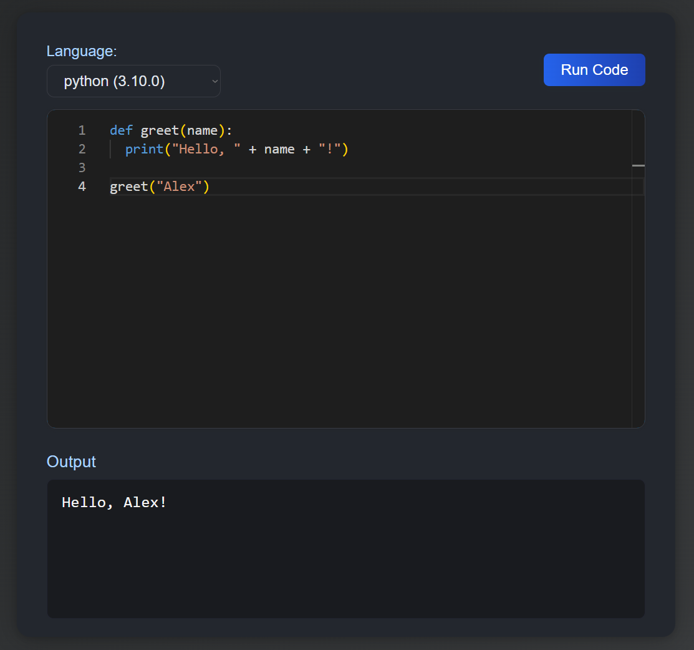

# Code Editor Web Component

A reusable, customizable code editor web component built on [Monaco Editor](https://microsoft.github.io/monaco-editor/). Supports JavaScript, Python, TypeScript, Java, C#, and PHP out of the box. Easy theming (light/dark), language selection, and instant output via [Piston API](https://github.com/engineer-man/piston).

## ✨ Features

- Modern code editor UI (Monaco-powered)
- Web Components: easy to use anywhere (framework-agnostic)
- Language selector
- Light/dark theme (`theme="light"` or `theme="dark"`)
- "Run code" button, output area, error display



## 📦 Installation
```bash
npm install code-editor-component
```

## 🚀 Usage

### Import in Your JavaScript

```js
import 'code-editor-component'; // Automatically registers <code-editor> and subcomponents
```

### Add Monaco Editor (Required)

In your HTML (usually in `<head>`):

```html
<script src="https://unpkg.com/monaco-editor@latest/min/vs/loader.js"></script>
```

### Use the Custom Element

```html
<code-editor language="python" theme="light"></code-editor>
<code-editor language="javascript"></code-editor>
```

## ⚙️ Options

| Attribute     | Type   | Default     | Description                         |
|---------------|--------|-------------|-------------------------------------|
| `language`    | String | javascript  | Initial language for editor         |
| `theme`       | String | dark        | `"light"` or `"dark"` theme         |

- Language choices: `javascript`, `typescript`, `python`, `java`, `csharp`, `php`

## 🛠️ Development

- All source code is in `src/`
    - `src/components/` — web components
    - `src/utils/` — shared logic/constants

